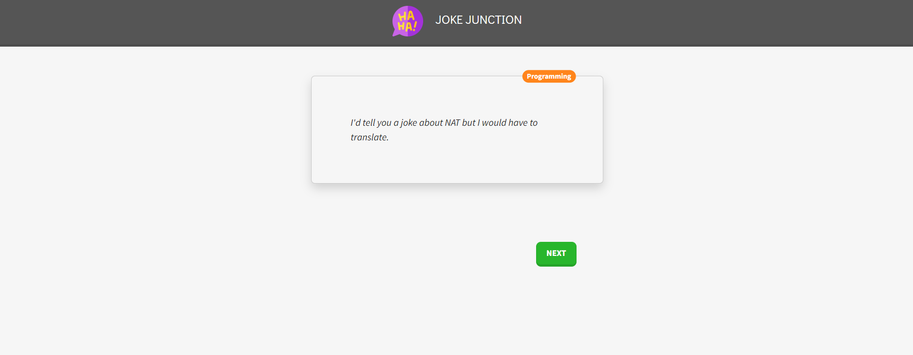

# Joke Junction App

- 'Joke Junction' is a Jokes app project created using ReactJS, HTML, CSS, Javasscript, Bootstrap.
- For fetching new jokes here I used a Jokes API : https://sv443.net/jokeapi/v2/
- Live Link: [Joke Junction](https://jokejunction.netlify.app/)

## Joke Junction !


## Steps to run
1) At first Clone repository
```
git clone https://github.com/jacktherock/Jokes-API-Project.git
```
2) Then install `node_modules`
```
npm i 
```
3) Then start react server
```
npm start
```

## Thanks for visiting!
