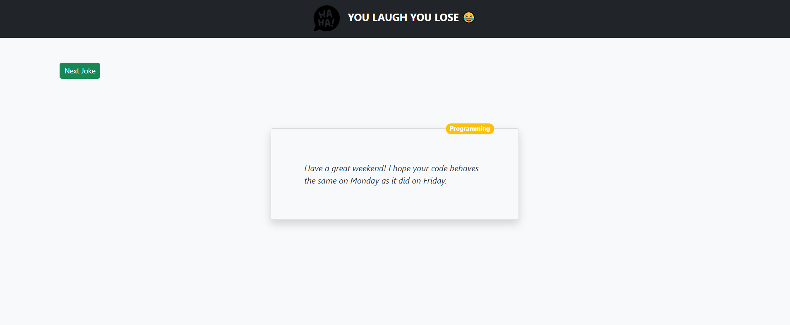

# You Laugh You Lose - Jokes

- 'You Laugh You Lose' is a Jokes app project created using ReactJS, HTML, CSS, Javasscript, Bootstrap.
- For fetching new jokes here I used a Jokes API : https://sv443.net/jokeapi/v2/

## You Laugh You Lose!


## Steps to run
1) At first Clone repository
```
git clone 
```
2) Then install `node_modules`
```
npm i 
```
3) Then start react server
```
npm start
```

## Thanks for visiting!